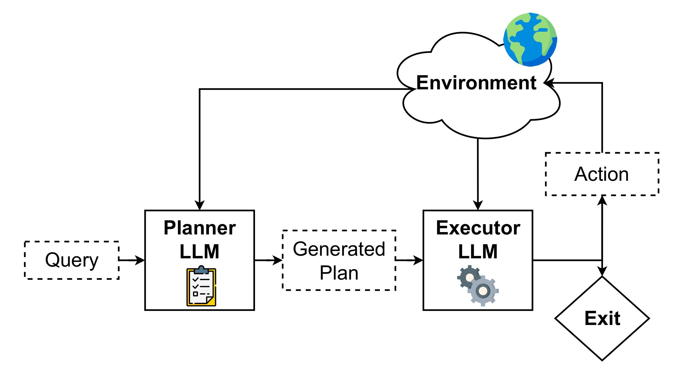

# Plan-and-Act: Improving Planning of Agents for Long-Horizon Tasks [[Paper](https://arxiv.org/abs/2503.09572)]



## TL;DR

We introduce Plan-and-Act, a framework that enables accurate and reliable long-horizon task solving with explicit planning. We additionally introduce a synthetic data generation method for training the planner.

**Abstract:** Large language models (LLMs) have shown remarkable advancements in enabling language agents to tackle simple tasks. However, applying them for complex, multi-step, long-horizon tasks remains a challenge. Recent work has found success by separating high-level planning from low-level execution, which enables the model to effectively balance high-level planning objectives and low-level execution details. However, generating accurate plans remains difficult since LLMs are not inherently trained for this task. To address this, we propose Plan-and-Act, a novel framework that incorporates explicit planning into LLM-based agents and introduces a scalable method to enhance plan generation through a novel synthetic data generation method. Plan-and-Act consists of a Planner model which generates structured, high-level plans to achieve user goals, and an Executor model that translates these plans into environment-specific actions. To train the Planner effectively, we introduce a synthetic data generation method that annotates ground-truth trajectories with feasible plans, augmented with diverse and extensive examples to enhance generalization. We evaluate Plan-and-Act using web navigation as a representative long-horizon planning environment, demonstrating a state-of-the-art 57.58% success rate on the WebArena-Lite benchmark as well as a text-only state-of-the-art 81.36% success rate on WebVoyager.

* **Dataset:** [Plan-and-Act Synthetic Data](https://huggingface.co/datasets/xTRam1/plan-and-act-data)
* **Planner Model:** [plan-and-act-planner-70b](https://huggingface.co/xTRam1/plan-and-act-planner-70b)
* **Executor Model:** [plan-and-act-actor-70b](https://huggingface.co/xTRam1/plan-and-act-actor-70b)

## Installation

### 1. Install Dependencies

```bash
pip install -r requirements.txt
```

### 2. Set up WebArena Environment

This code is designed to work with the WebArena-Lite environment. Follow these steps:

1. **Clone and set up WebArena-Lite:**

   ```bash
   git clone https://github.com/THUDM/VisualAgentBench.git
   cd VisualAgentBench/VAB-WebArena-Lite
   # Follow the installation instructions in the WebArena-Lite README
   ```

2. **Place this repository in the WebArena directory:**

   ```bash
   # Copy this Plan-and-Act repository into the WebArena-Lite directory
   cp -r /path/to/plan-and-act-repo ./plan_and_act
   ```

3. **Follow the WebArena-Lite setup instructions** from [https://github.com/THUDM/VisualAgentBench/tree/main/VAB-WebArena-Lite](https://github.com/THUDM/VisualAgentBench/tree/main/VAB-WebArena-Lite) to launch the WebArena environment.

## Usage

### Running Plan-and-Act

- **Basic execution:** `python run_plan_and_act.py`
- **With replanning:** `python run_plan_and_act_with_replanning.py`
- **Parallel execution:** Use the provided shell scripts for batch processing

### Framework Components

For detailed information about specific components, see:

- **[Core Framework](plan_and_act/cot/README.md)** - Models, utilities, and core framework components
- **[Inference Components](plan_and_act/cot/inference/README.md)** - Planning and execution inference modules
- **[Data Generation](plan_and_act/cot/data_generation/README.md)** - Synthetic data generation for training

## Citation

If you find our work helpful, please consider citing us:

```bibtex
@inproceedings{
erdogan2025planandact,
title={Plan-and-Act: Improving Planning of Agents for Long-Horizon Tasks},
author={Lutfi Eren Erdogan and Hiroki Furuta and Sehoon Kim and Nicholas Lee and Suhong Moon and Gopala Anumanchipalli and Kurt Keutzer and Amir Gholami},
booktitle={Forty-second International Conference on Machine Learning},
year={2025},
url={https://openreview.net/forum?id=ybA4EcMmUZ}
}
```
